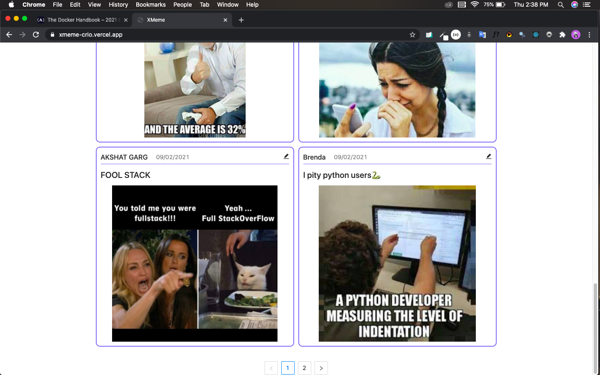
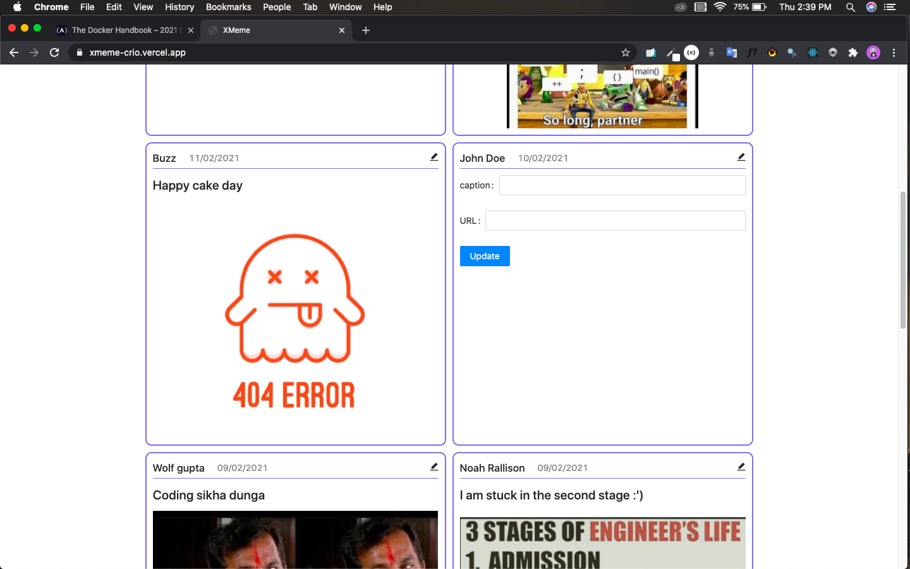

# XMeme 🤡
(*Deployed Server has been taken down, Try it on your local machine.*)


<br/>
A Simple application where people can post and read memes.

## Installation

Your local system must have node,npm and mongoDB to run this application locally.
if not run the install.sh file by
```bash
sh install.sh
```
to install dependencies 
```bash
cd server
npm install
cd client
npm install
```
## Running it locally
after installing all dependencies
```bash
cd server
nodemon index.js
cd client
npm start
```
## Tech stack used for creating it
 1. ReactJS with typescript [client/frontend]
 2. NodeJS with express [server/backend]
 3. MongoDB [database]

## Usage

**This app can be used to post memes via the form.**


**The app shows the top 100 latest memes.**



**Update the uploaded memes**



## Components
A. Complete form validation : Both frontend and server side validation for forms.

B. Pagination : A page consists of only 10 memes and the other memes are paginated.

C. Responsive : Completely responsive and looks good on all size devices.

## API
The API is documented using swagger-ui check it out : <a href="https://xmeme-crio.herokuapp.com/swagger-ui/">here</a>

## Contributing
Pull requests are welcome. For major changes, please open an issue first to discuss what you would like to change.

## License
[MIT](https://choosealicense.com/licenses/mit/)
